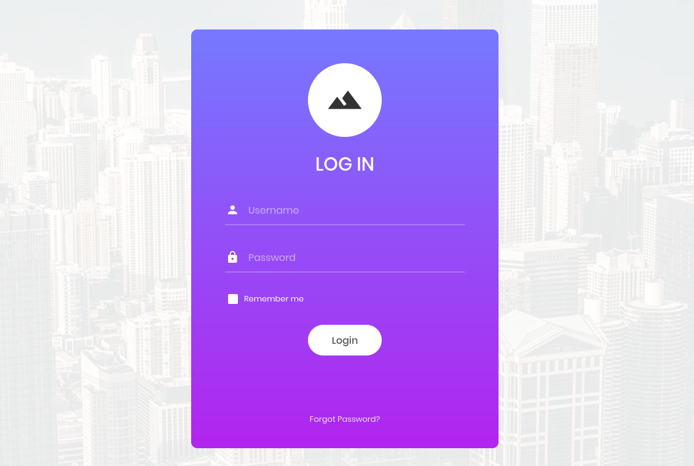

# HTB – Appointment

**Difficulty:** Very Easy  
**Category:** Web / SQL Injection  
**OS:** Linux  

---

## Overview

Appointment is a beginner-friendly Hack The Box Starting Point machine that introduces the fundamentals of SQL Injection vulnerabilities in web applications. The objective is to identify an injectable login form and bypass authentication using SQL comments.

This machine maps to **OWASP Top 10 – A03:2021 (Injection)**.

---

## Assessment Tasks & Answers (Non-Flag)

The following assessment tasks were completed as part of the HTB Appointment lab. These questions validate understanding of fundamental web security concepts. Flag values are intentionally excluded.

---

### Task 1: SQL Fundamentals

**Question:**  
What does the acronym SQL stand for?

**Hint:**  
A simple Google search will yield the answer. Use Camel Case.

**Answer:**  
Structured Query Language

---

### Task 2: Common SQL Vulnerabilities

**Question:**  
What is one of the most common types of SQL vulnerabilities?

**Hint:**  
Mentioned in the write-up's Introduction section.

**Answer:**  
SQL Injection

---

### Task 3: OWASP Classification

**Question:**  
What is the 2021 OWASP Top 10 classification for this vulnerability?

**Hint:**  
It holds third place in the OWASP Top 10 2021 list of most commonly met web vulnerabilities. Use the complete classification name.

**Answer:**  
A03:2021–Injection

---

### Task 4: Service Enumeration

**Question:**  
What does Nmap report as the service and version running on port 80?

**Hint:**  
Exact string under the VERSION column of the scan results.

**Answer:**  
Apache httpd 2.4.38 ((Debian))

**Tools Used:**
- Nmap

---

### Task 5: HTTPS Fundamentals

**Question:**  
What is the standard port used for the HTTPS protocol?

**Hint:**  
It's different from the unsecured version.

**Answer:**  
443

---

### Task 6: Web Application Terminology

**Question:**  
What is a folder called in web-application terminology?

**Hint:**  
Whenever I'm a bad employee, I get called to the "director's" office.

**Answer:**  
Directory

---

### Task 7: HTTP Response Codes

**Question:**  
What HTTP response code is returned for "Not Found" errors?

**Hint:**  
Look up HTTP response codes.

**Answer:**  
404

---

### Task 8: Directory Enumeration

**Question:**  
What Gobuster switch is used to brute force directories instead of subdomains?

**Hint:**  
Shorthand name for directories.

**Answer:**  
dir

---

### Task 9: SQL Comment Syntax

**Question:**  
What single character can be used to comment out the rest of a line in MySQL?

**Hint:**  
-- also makes a comment, but that's two characters.

**Answer:**  
#

---

### Task 10: Authentication Bypass Validation

**Question:**  
After successfully bypassing authentication, what is the first word displayed on the webpage?

**Hint:**  
Try adding a comment at the end of the username. 
Go to browser and access victim page > http://IP_TARGET , then execute the payload

---

> **Note:** Root/flag values are intentionally excluded in accordance with Hack The Box content guidelines.

