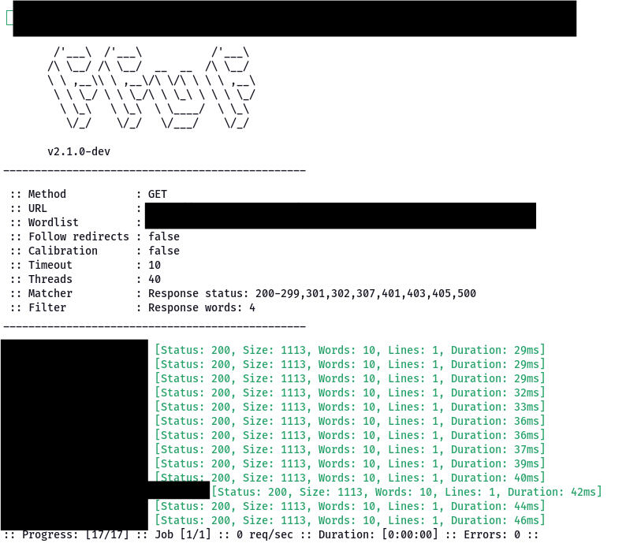
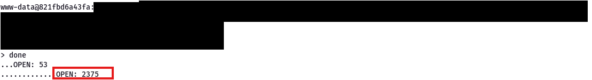

# HTB – MonitorsFour

**Difficulty:** Easy  
**OS:** Windows  
**Attack Chain:** Web → API → Application → Container → Host

---

## Overview
This write-up documents the compromise of the HTB *MonitorsFour* machine.
The assessment demonstrates how multiple low-to-medium severity
misconfigurations and logic flaws can be chained together to achieve
full host-level compromise.

---

## Attack Summary
1. Web enumeration identified exposed configuration files
2. Authentication bypass was achieved through PHP type juggling in an API endpoint
3. User data was disclosed, enabling offline MD5 hash cracking
4. Authenticated remote code execution was obtained in Cacti (CVE-2025-24367)
5. Initial access was gained inside a Docker container
6. Internal enumeration revealed an exposed Docker API (port 2375)
7. Host filesystem access resulted in full root compromise

---

## Evidence of Hands-On Testing

The following redacted screenshots demonstrate key findings during the assessment.
Sensitive values and identifiers have been intentionally removed.

---

## Key Vulnerabilities
- Publicly accessible `.env` configuration file
- API authentication logic flaw (loose comparison)
- Weak password hashing (MD5)
- Outdated and vulnerable Cacti installation
- Unauthenticated Docker API exposed internally

---

## Tools Used
Nmap, Dirsearch, FFUF, curl, Hashcat, Netcat, Bash, Docker HTTP API

---

## Lessons Learned
- Containers should not be treated as a security boundary
- Logic flaws in authentication can be more impactful than missing controls
- Individually low-risk misconfigurations can combine into critical compromise

---

## Mitigations
- Prevent public access to sensitive configuration files
- Enforce strict comparison (`===`) in authentication logic
- Store passwords using modern, adaptive hashing algorithms (bcrypt / argon2)
- Maintain up-to-date third-party applications and dependencies
- Disable unauthenticated Docker API access and restrict management interfaces
- Apply proper container isolation and internal network segmentation

---

## Skills Demonstrated
- Web and API Enumeration
- Authentication Logic Flaw Analysis
- Password Hash Analysis and Cracking
- Authenticated Application Exploitation
- Container Escape Techniques
- Docker API Abuse and Post-Exploitation

---

## MITRE ATT&CK Mapping
The following techniques were observed during the exploitation of this machine:

- **T1595 – Active Scanning**  
  Web and service enumeration to identify exposed endpoints and applications

- **T1190 – Exploit Public-Facing Application**  
  Abuse of web application misconfigurations and vulnerable services

- **T1078 – Valid Accounts**  
  Use of cracked credentials to authenticate to the Cacti application

- **T1059 – Command and Scripting Interpreter**  
  Execution of commands via authenticated remote code execution

- **T1611 – Escape to Host**  
  Container escape through abuse of exposed Docker API

- **T1105 – Ingress Tool Transfer**  
  Transfer of payloads and interaction with remote services during post-exploitation

---

## Disclaimer
This write-up is provided for educational purposes only.
All testing was conducted in a controlled Hack The Box lab environment.

